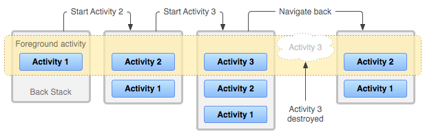

### 02_ 정다은 _Activity Lifecycle


#### 0) 안드로이드의 4대 구성요소

##### 	1. 액티비티(Activity)

​		화면 하나당 하나의 액티비티를 가지며, 눈에 보이는 화면을 만들 때 최소 1개가 필요하다. 여러 개의 액티비티로 구성		

​		된 앱에는 메인 액티비티가 1개 존재한다.

##### 	2. 리시버(Receiver)

​		안드로이드에는 내부의 수많은 브로드캐스트들이 있다. 대표적인 브로드캐스트의 예로 "전화 수신", "문자 수신", "배터

​		리 부족" 등이 있다. 이 중에서 원하는 브로드캐스트를 수신하는 객체가 리시버이다. 구현이 간단한 편.

##### 	3. 프로바이더(Provider)

​		데이터베이스나 파일 등의 정보를 외부의 앱에 공개하기 위한 객체이며, ContentProvider 클래스를 상속받아서 구현

​		한다. 이미 제공되는 프로바이더를 사용하는 것은 쉽지만 직접 앱 내에 프로바이더를 만드는 것은 복잡하고 어렵다. 사

​		용빈도는 낮은 편.

##### 	4. 서비스(Service)

​		액티비티와 별개로 백그라운드에서 오래 수행되어야 하는 앱을 작성할 때 사용. 액티비티와는 다르게 화면이 없다.


#### 1) Activity란?

##### Activity는 일종의 애플리케이션 구성 요소

액티비티는 상호작용할 수 있는 화면을 제공한다. 액티비티마다 창이 하나씩 주어져 이곳에 사용자 인터페이스를 끌어올 수 있다. 이 창은 일반적으로 화면을 가득 채우지만, 작은 창으로 만들어 다른 창 위에 띄울 수도 있다.  새로운 액티비티가 시작될 때 마다 이전 액티비티는 중단되지만 시스템은 해당 액티비티를 스택("백 스택")에 보존한다.


#### 2) Activity 생성

액티비티를 생성할 때는 Activity 클래스의 하위 클래스 중에서 하나를 상속받는다. 액티비티를 생성하면 액티비티 생성, 중단, 재개, 소멸 시기 등과 같은 생명 주기의 다양한 상태 간 액티비티가 전환될 때 시스템이 호출하는 **콜백 메서드**(callback method)를 구현해야 한다. 콜백 메서드를 간단히 말하면, 내가 메서드를 실행하지 않아도 어떤 순간에 스스로 호출되는 메서드이다. 콜백 메서드의 예로는 onCreate(), onPause() 등이 있다.

~~~java
public class MainActivity extends AppCompatActivity {
    @Override
    protected void onCreate(Bundle savedInstanceState) {
        super.onCreate(savedInstanceState);
        setContentView(R.layout.activity_main)
    }
}
~~~

(처음 액티비티를 생성하였을 때의 형태)

액티비티를 종료하기 위해선 back버튼을 누르거나, finish() 메서드를 호출하면 된다. 또는, finishActivity()를 호출하여 별도의 액티비티를 종류할 수도 있다.


#### 3) Activity Stack

하나의 애플리케이션에는 보통 여러 개의 액티비티가 들어있다. 이런 경우 액티비티는 실행되는 순서대로 스택에 차곡차곡 쌓인다. 현재 액티비티가 또 다른 액티비티를 시작하는 경우, 새 액티비티가 스택의 맨 위에 푸시되고 포커스를 갖게된다. 이전 액티비티는 스택에 유지되지만, 중단된다. 액티비티가 중단되면 시스템은 이 액티비티의 사용자 인터페이스의 현재 상태를 보존한다. 사용자가 back 버튼을 눌러 현재 보이는 액티비티를 종료하면, 맨 위에 있던 액티비티가 소멸하고 그 아래에 있는 액티비티가 보인다. 이러한 구조를 자료구조에서는 **'스택(stack)'** 이라고 한다. 그리고 액티비티를 관리하는 스택을 **'액티비티 백스택(activity back stack)'** 이라고 한다. 스택에 있는 액티비티는 결코 다시 정렬되지 않는다. 다만 스택에서 팝되거나 스택으로 푸시될 뿐이다. 따라서, 백 스택은 일종의 **"후입선출"** 객체 구조로서 작동한다고 할 수 있다.


(여러 액티비티가 관리되는 백스택)

위 그림에서 Foreground activity가 현재 실행 중인 액티비티이다. 액티비티를 Activity1 → Activity2 → Activity3 순으로 차례대로 수행하고 back버튼으로 Activity3을 제거했을 때 백스택의 상태 변화를 그림으로 나타낸 것이다.


#### 4) Activity Lifecycle



(액티비티 생명주기)

액티비티는 다음 그림과 같은 생명주기(LifeCycle)를 가지고 있다. 이 생명주기에 따라 적절한 메소드가 호출되므로 이를 숙지해서 액티비티를 작성해야 한다.

##### onCreate()

​	액티비티가 **처음 생성되었을 때** 호출된다. 이 곳에서 일반적인 정적 설정을 모두 수행해야 한다. 즉 뷰 생성, 목록에 데이터 바	

​	인딩하기 등을 말한다. 이 뒤에는 항상 **onStart()**가 따라온다.

##### onRestart()

​	액티비티가 중단되었다가 **다시 시작되기 직전**에 호출된다. 이 뒤에는 항상 **onStart()**가 따라온다.

##### onStart()

​	액티비티가 **사용자에게 표시되기 직전**에 호출된다. 액티비티가 전경으로 나오면 **onResume()**이 뒤에 따라오고, 액티비티	

​	가 숨겨지면 **onStop()**이 뒤에 따라온다.

##### onResume()

​	액티비티가 시작되고 **사용자와 상호작용하기 직전**에 호출된다. 이 시점에서 액티비티는 액티비티 스택의 맨 위에 있으며, 사

​	용자가 정보를 입력하고 있다. 이 뒤에는 항상 **onPause()**가 따라온다.

##### onPause()

​	시스템이 **다른 액티비티를 재개하기 직전**에 호출된다. 이 메서드 사이에 해야 할 일들은 상당히 가벼워야 한다. 이 구간은 빠

​	르게 지나가므로 오래 걸리는 처리는 피해야 한다는 뜻이다. 이 구간에 오래 걸리는 처리를 하게 되면 앱의 화면 전환이 느려

​	진다. 액티비티가 다시 전경으로 돌아오면 **onResume()**이 뒤에 따라오고 액티비티가 사용자에게 보이지 않게 되면 

​	**onStop()**이 뒤에 온다.

##### onStop()

​	액티비티가 더 이상 **사용자에게 표시되지 않게 되면** 호출된다. 이것은 액티비티가 소멸되고 있기 때문에 일어날 수도 있고, 다

​	른 액티비티가 재개되어 이것을 덮고 있기 때문일 수도 있다. 액티비티가 다시 사용자와 상호작용하면 **onRestart()**가 뒤에 	

​	따라오고 액티비티가 사라지면**onDestroy()**가 뒤에 따라온다.

##### onDestroy()

​	액티비티가 **소멸되기 전**에 호출된다. 이것이 액티비티가 받는 마지막 호출이다. 이것이 호출될 수 있는 경우는 액티비티가 완

​	료되는 중이기 때문(누군가가 여기에 finish()를 호출해서)일 수도 있고, 시스템이 공간을 절약하기 위해 액티비티의 이 인스

​	턴스를 일시적으로 소멸시키는 중이기 때문일 수도 있다.


```java
public class MainActivity extends AppCompatActivity {
    @Override
    public void onCreate(Bundle savedInstanceState) {
        super.onCreate(savedInstanceState);
        // 액티비티가 생성됨
    }
    @Override
    protected void onStart() {
        super.onStart();
        // 액티비티가 화면에 보이기 직전
    }
    @Override
    protected void onResume() {
        super.onResume();
        // 액티비티가 화면에 보임
    }
    @Override
    protected void onPause() {
        super.onPause();
        // 다른 액티비티가 실행되어, 이 액티비티는 화면에서 안 보이기 직전
    }
    @Override
    protected void onStop() {
        super.onStop();
        // 액티비티가 더 이상 화면에서 보이지 않음
    }
    @Override
    protected void onDestroy() {
        super.onDestroy();
        // 액티비티가 종료됨
    }
}
```

(모든 생명주기 콜백을 구현한 코드)
