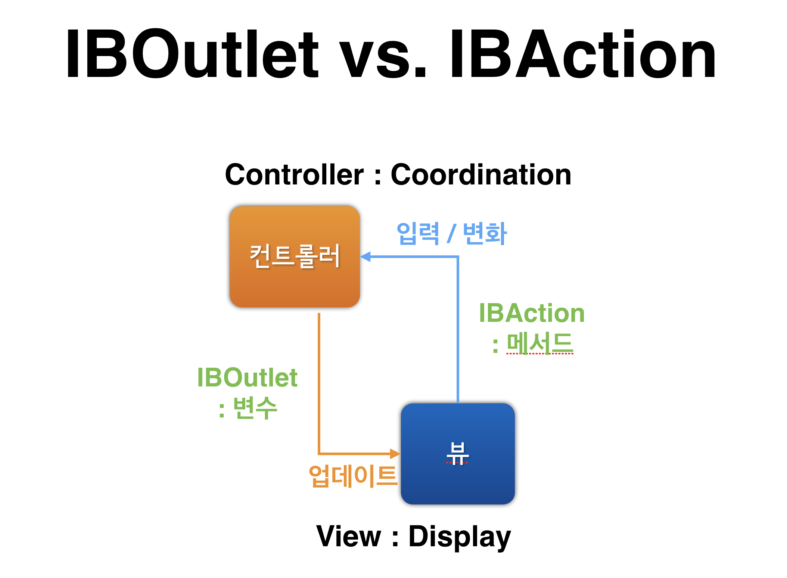

# IBOutlet & IBAction

### 1. UIKit
- UIKit는 IOS 어플리케이션에서 사용자 인터페이스를 구현하고 이벤트를 관리하는 프레임워크이다.
- UIKit 프레임워크는 제스처 처리, 애니메이션, 그림 그리기, 이미지 처리, 텍스트 처리 등 사용자 이벤트 처리를 위한 클래스를 포함한다.
- 또한 테이블뷰, 슬라이더, 버튼, 텍스트 필드, 얼럿 창 등 애플리케이션의 화면을 구성하는 요소를 포함한다. 
- ViewController은 UIKit 안에 있는 UIViewController 를 상속 받고있기 때문에 이를 import 시켜줘야한다.
```swift
import UIKit

class ViewController: UIViewController {
    override func viewDidLoad() {
        super.viewDidLoad()
        // Do any additional setup after loading the view, typically from a nib.\
    }
}
```

그렇다면 이런 뷰를 소스코드애서 제어하려면 어떻게 해야할까?

### 2. IBOutlet
우리가 뷰를 소스코드에서 제어하기 위해 사용하는 것이 IBOutlet이다.   
본래의 Outlet은 물건을 싸게 처분하다 등의 의미를 가지고 있지만, IOS 애서는 연결 통로? 라는 의미로 사용한다.   
따라서 이름 그대로 해석하면 IB는 Interface Builder, Outlet은 연결 통로로 Interface Builder 안에 있는 뷰를 ViewController에서 제어하기 위해 사용하는 변수이다.

사용방법은 간단하다. 제어하고 싶은 View의 변수를 선언해주고 앞에 IBOutlet을 명시해준다.  
또는 interface builder 안에서 control + click 하여 드래그로 ViewController에 추가하는 방법도 있다.

```swift
@IBOutlet weak var label: UILabel!
```
-  Label을 아웃렛 연결해준 코드

### 3. IBAction
IBAction은 interface builder 안에 있는 View의 이벤트를 처리해주는 역할을 한다.  
IBACtion을 사용하는 방법은 IBOutlet 처럼 함수 앞에 IBAction을 명시해줌으로써 사용할 수 있고, interface builder 안에서 control + click 하여 드래그로 ViewController에 추가하는 방법도 있다.  
함수 블록 안에는 이벤트 발생시 처리해줄 코드를 적어주면 된다.
```swift
@IBAction func btnclick(_ sender: Any) {
    // somthing todo
    }
```
- Button을 액션 연결해준 코드

### 4. IBOutlet vs IBAction ?
그렇다면 IBOutlet 과 IBAction 은 무슨 차이가 있을까?



IBAction은 사용자와 상호작용하여 이벤트를 감지하고, ViewController 에게 알리는 역할을 하지만 IBOutlet은 처리 결과를 뷰에 알려서 원하는 동작을 끌어낸다.  
또, UIControl 을 상속하느냐 안하느냐에 따라 IBAction의 소유 여부가 달라지게 된다.

~~~swift
@class UITouch;
@class UIEvent;

//______________________________________________________

NS_CLASS_AVAILABLE_IOS(2_0) @interface UIControl : UIView

... 

// the action cannot be NULL. Note that the target is not retained.
- (void)addTarget:(nullable id)target action:(SEL)action forControlEvents:(UIControlEvents)controlEvents;

// remove the target/action for a set of events. pass in NULL for the action to remove all actions for that target
- (void)removeTarget:(nullable id)target action:(nullable SEL)action forControlEvents:(UIControlEvents)controlEvents;
~~~

UIControl 헤더 파일을 보면 위처럼 UIControl은 UIVIew 를 상속받고 있으며, UITouch와 UIEvent를 참조하고있다. 그렇기에 View의 역할을 하면서도 위 코드 처럼 Action을 수행하는 기능도 갖고있는 것이다. 따라서 UIControl 을 상속하는가에 따라 IBAction을 소유하는 여부가 달라진다.

~~~swift
//IBAction 을 소유한 클래스
@interface UIButton : UIControl
@interface UISegmentedControl : UIControl
@interface UITextField : UIControl
@interface UISlider : UIControl
@interface UISwitch : UIControl

//IBAction 을 소유하지 않은 클래스 
@interface UITextView : UIScrollView
@interface UIScrollView : UIView
@interface UIImageView : UIView
@interface UIProgressView : UIView
@interface UIActivityIndicatorView : UIView
@interface UITableView : UIScrollView
~~~