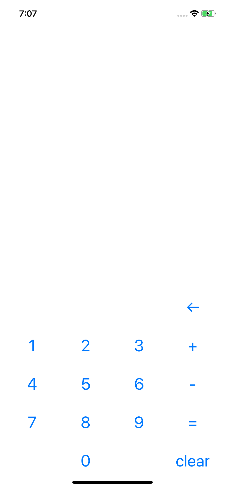

# 계산기앱을 만들어보자(iOS)

### 1) UI

### 2) 구조

#### 더하고, 빼고, 결과 보고, 초기화 까지

##### <사용할 대표 변수들>

sum: Int

isTypingNumber: Bool

isPlus: Bool

isMinus: Bool

##### <조건>

1. back버튼을 클릭할 경우 입력 했던 number의 마지막 삭제
2. = 버튼을 클릭할 경우 결과 보여주기
3. clear버튼을 클릭할 경우 초기화
4. +/- 버튼 클릭 후 숫자를 입력할때 number 초기화

### 3) 간단한 Swift 문법

#### 1. 변수선언

##### var/let 변수명 [: 타입] = 초기값

~~~swift
var sum: Int = 0

let sum: Int = 0

var sum = 0
~~~

#### 2. 조건문

~~~swift
    if 조건 {
    ...
    } else if 조건 {
        ...
    } else {
        ...
    }
~~~

#### 3. ? , !

##### ?(optional) : nil일수도, 아닐수도  (wrapping)

~~~swift
var name: String? = "Daeun"
print(name)
~~~

출력 값 : Optional("Daeun")

##### ! : forced unwrapping

~~~swift
print(name)
~~~

출력 값 : Daeun

### 4) 구현하기

#### 1. 숫자 클릭시 label에 숫자 입력

10개의 버튼에 IBAction을 연결하여 label의 text에 숫자를 추가해주자

또한, 조건 4번에 따라 isTypingNumber를 이용하여 true일 경우엔 label의 텍스트에 추가만하고, false일 경우엔 label의 텍스트를 초기화하여 추가

~~~swift
    @IBAction func numberClick(_ numberBtn: UIButton) {
        if isTypingNumber {
            resultLabel.text = resultLabel.text! + (numberBtn.titleLabel?.text)!
        } else {
            resultLabel.text = (numberBtn.titleLabel?.text)!
            isTypingNumber = true
        }
    }
~~~

#### 2. back버튼으로 숫자 하나씩 delete

back버튼에 IBAction을 달아 label text의 마지막 문자를 삭제해주자

~~~swift
    @IBAction func deleteNumber(_ sender: UIButton) {
        resultLabel.text = String((resultLabel.text?.dropLast())!)
    }
~~~

#### 3. +/-버튼으로 숫자 더하기/빼기

+, -버튼에 IBAction을 달아 입력했던 숫자를 저장해주고, isPlus/isMinus를 true로, isTypingNumber는 false로 설정해주자. (실제 계산은 =버튼에서 할 예정)

~~~swift
    @IBAction func calculatePlus(_ sender: UIButton) {
        if !isPlus {
            sum = Int((resultLabel?.text)!)! + sum
            isTypingNumber = false
            isPlus = true
        }
    }
    
    @IBAction func calculateMinus(_ sender: UIButton) {
        if !isMinus {
            sum = Int((resultLabel?.text)!)! - sum
            isTypingNumber = false
            isMinus = true
        }
    }
~~~

#### 4. =버튼으로 sum값 보여주기

=버튼에 IBAction을 달아 isPlus/isMinus에 따라 + 또는 - 연산을 한 후, label에 띄워주자
후에 isPlus/isMinus, isTypingNumber는 false로,sum은 0으로 초기화

~~~swift
@IBAction func showResult(_ sender: UIButton) {
        if isPlus {
            sum = sum + (Int(resultLabel.text!)!)
            isPlus = false
        } else if isMinus {
            sum = sum - (Int(resultLabel.text!)!)
            isMinus = false
        } else {
            sum = Int(resultLabel.text!)!
        }
        resultLabel.text = String(sum)
        sum = 0
        isTypingNumber = false
    }
~~~

#### 5. clear버튼으로 초기화

isTypingNumber, isMinus, isPlus, sum, label 모두 초기화

~~~swift
    @IBAction func clear(_ sender: UIButton) {
        sum = 0
        resultLabel.text = ""
        isTypingNumber = false
        isMinus = false
        isPlus = false
    }
~~~

### 5) 마무리

[전체 코드 주소](https://github.com/DaeunJeong/Danny-iOS/tree/master/SimpleCalculatorApp)